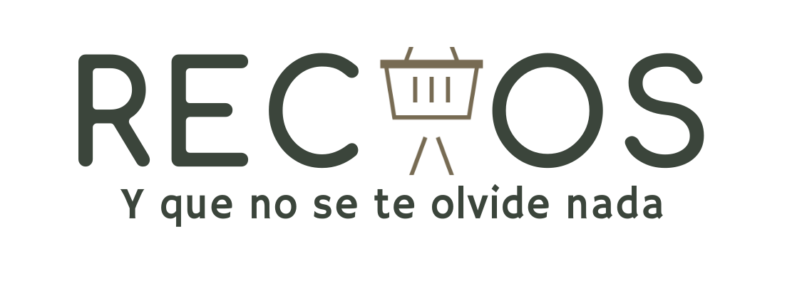

<h1 align="center">
   
  

   
  

  RECAOS
   
</h1>

<h4 align="center">' <a href='https://recaos.netlify.app'> RECAOS </a> 'is a <strong> shopping grocery list </strong> developed with in React and using Tailwind CSS and Firebase for data backup.  </h4>

  <a href="#getting-started">Getting Started</a> •
  <a href="#faq">Contributing</a> •
  <a href="#license">License</a>

## Getting Started

Only use the app in [link](https://recaos.netlify.app) and enter your items list. Check when you have your element in the list and add, delete or update somethings new.

## Brand Colors

#eef1f0
#b1cab2
#9daa92
#8a8a72
#776b53

## Contributing

Contributions are what make the open source community such an amazing place to learn, inspire, and create. Any contributions you make are **greatly appreciated**.

If you have a suggestion that would make this better, please fork the repo and create a pull request. You can also simply open an issue with the tag "enhancement". Thanks again!

## License

Feel free use and improve
🙂

---

> GitHub [@b0lemix](https://github.com/b0lemix) &nbsp;&middot;&nbsp;
